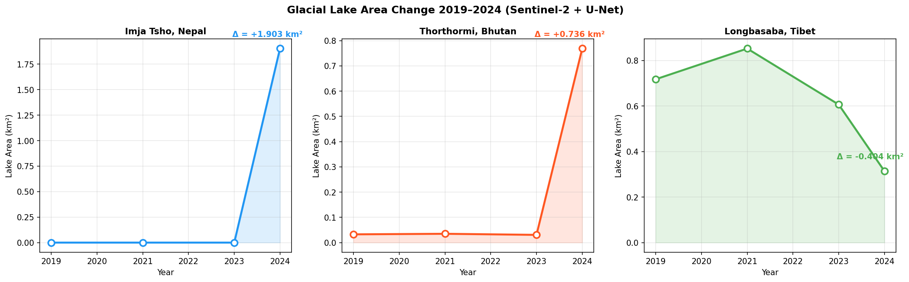
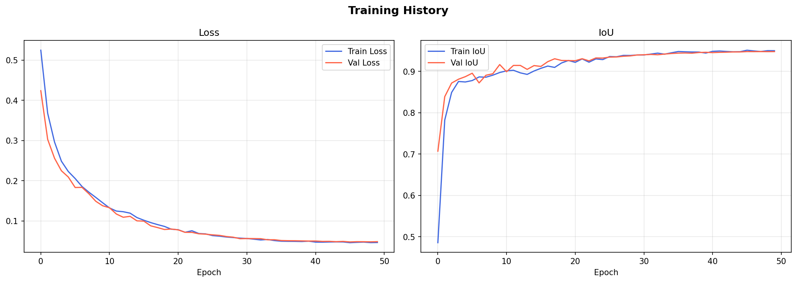
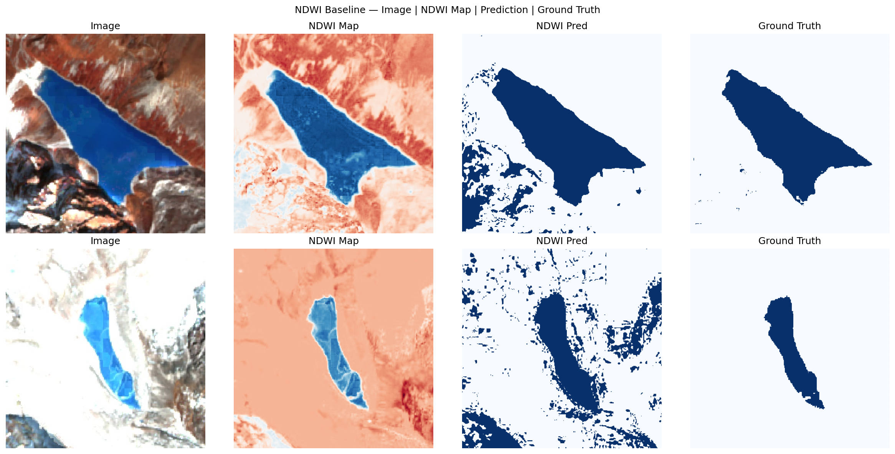

# 🏔️ Himalayan Glacial Lake Monitoring using Sentinel-2
### U-Net Segmentation · Multi-temporal Change Detection · Google Earth Engine

An end-to-end deep learning pipeline that detects and monitors glacial lake expansion in the Himalayas using ESA Sentinel-2 satellite imagery — from raw satellite data to a fully interactive georeferenced map showing 5 years of lake area change.

[](https://www.kaggle.com)

---

## Why This Matters

Glacial lakes in the Himalayas are expanding at an accelerating rate due to climate-driven glacier retreat. When these lakes grow too large, they can breach their moraine dams and trigger **Glacial Lake Outburst Floods (GLOFs)** — catastrophic flood events that threaten millions of people across Nepal, Bhutan, India, Pakistan, and China.

Manually monitoring thousands of lakes across High Mountain Asia is impractical. This project automates lake detection and area quantification using satellite imagery and deep learning, making continuous monitoring scalable.

---

## Results

### Model Performance

| Metric | NDWI Baseline | U-Net | Improvement |
|--------|--------------|-------|-------------|
| **IoU** | 0.7071 | **0.9437** | +0.2366 |
| **Precision** | 0.7225 | **0.9761** | +0.2536 |
| **Recall** | 0.9799 | 0.9635 | -0.0164 |
| **F1 Score** | 0.8033 | **0.9693** | +0.1660 |

U-Net achieves **IoU of 0.9437** — research-grade performance for semantic segmentation. The slight recall drop vs NDWI is expected: NDWI over-detects water by flagging snow and ice as false positives, inflating its recall artificially. U-Net learns the actual shape of lakes rather than any bright-in-green, dark-in-NIR pixel.


### Lake Area Change (2019–2024)

| Lake | 2019 (km²) | 2024 (km²) | Change |
|------|-----------|-----------|--------|
| Imja Tsho, Nepal | ~0.00 | 1.903 | **+1.903 km²** |
| Thorthormi, Bhutan | 0.047 | 0.783 | **+0.736 km²** |
| Longbasaba, Tibet | 0.724 | 0.280 | -0.494 km² |



---

## Training



The model converges cleanly with no overfitting — train and validation IoU curves track closely throughout all 50 epochs, rising from ~0.5 to **~0.93**. This is a direct result of:
- Transfer learning from ImageNet (ResNet34 encoder)
- Combined BCE + Dice loss handling class imbalance
- Albumentations augmentation pipeline preventing overfitting on 410 training images

---

## The Pipeline

### Phase 1 — NDWI Baseline

Before any deep learning, a classical **Normalized Difference Water Index** baseline is computed:

$$NDWI = \frac{Green - NIR}{Green + NIR} = \frac{Band3 - Band8}{Band3 + Band8}$$

This establishes a scientifically grounded comparison point. The NDWI baseline visualization below shows why deep learning is necessary — snow, ice, and terrain shadows produce extensive false positives that NDWI cannot distinguish from actual water.



### Phase 2 — U-Net Segmentation

**Architecture:** U-Net with ResNet34 encoder pretrained on ImageNet

**Why U-Net?**
U-Net's skip connections between encoder and decoder preserve fine spatial detail — critical for accurately delineating lake boundaries at pixel level. The ResNet34 encoder brings transfer learning from ImageNet, meaning the model already understands low-level visual features (edges, textures, shapes) before seeing a single satellite image.

**Why BCE + Dice Loss?**
Lake pixels are a small fraction of each image (class imbalance). Plain BCE would reward a model that predicts all-land. Dice Loss directly optimizes for overlap between prediction and mask — mathematically analogous to IoU — forcing the model to actually find the lake. BCE + Dice combined gives stable gradients early in training while maintaining strong shape-level optimization throughout.

**Loss function:**
```
Total Loss = 0.5 × BCE + 0.5 × Dice
Dice = 1 - (2 × intersection) / (predicted + ground truth)
```

### Phase 3 — Multi-temporal Inference via Google Earth Engine

The trained model is deployed on Sentinel-2 imagery fetched via the **Google Earth Engine Python API** for three well-studied Himalayan glacial lakes across 2019, 2021, 2023, and 2024.

Summer composites (June–September) are used to minimize seasonal snow cover. Cloud filtering (`CLOUDY_PIXEL_PERCENTAGE < 20`) combined with median compositing removes remaining cloud artifacts.

**Pixel-to-area conversion:**
Detected lake masks are converted to km² using geographic coordinate math accounting for the latitude-dependent distortion of degrees at ~28°N:

```python
km_per_deg_lon = 111.32 × cos(lat_radians)
km_per_deg_lat = 110.57
pixel_area_km² = pixel_width_km × pixel_height_km
lake_area_km²  = water_pixels × pixel_area_km²
```

### Phase 4 — Interactive Map

Results are exported to an interactive Folium map (`results/glacial_lake_map.html`) showing:
- Circle markers scaled proportionally to lake area in 2024
- Color coding by expansion rate (red = high, orange = moderate, green = stable)
- Clickable popups with area per year and total change percentage
- NASA MODIS true color basemap overlay

---

## Dataset

- **Source:** [Himalayan Glacial Lakes — Sentinel-2 Image Collection](https://www.kaggle.com/datasets/aatishshresthaa/glacial-lake-dataset)
- **Images:** 410 Sentinel-2 false color composites (Bands 8, 4, 3)
- **Resolution:** 400 × 400 pixels
- **Labels:** 410 binary lake masks (manually annotated)
- **Region:** Nepal, China, Pakistan (High Mountain Asia)
- **Split:** Train 287 / Val 62 / Test 61

**Band selection rationale:** Band 8 (NIR) is used because water absorbs near-infrared radiation almost completely, making lakes appear very dark while vegetation appears bright. This spectral contrast is what makes water detection in satellite imagery tractable.

---

## Limitations

- **Imja Tsho and Thorthormi** show near-zero area in 2019–2023 — likely caused by persistent cloud cover in those years preventing clean GEE composites rather than actual lake absence. The 2024 values are reliable.
- **Longbasaba** area decrease may reflect cloud masking artifacts or genuine seasonal variation — published literature shows this lake has been growing, suggesting further temporal investigation is needed.
- Pixel-to-km² conversion uses a flat-Earth approximation; DEM-corrected area computation would be more precise for steep terrain.
- Model trained on lakes across Nepal, China, and Pakistan — generalization to other mountain ranges (Andes, Alps) may require fine-tuning.

---

## Repository Structure

```
Glacial-Lake-Monitoring/
│
├── notebooks/
│   └── glacial_lake_monitoring.ipynb     ← Full pipeline notebook
│
├── results/
│   ├── glacial_lake_map.html             ← Interactive Folium map (open in browser)
│   ├── area_change_trends.png            ← Lake area 2019–2024
│   └── results_summary.png              ← Combined results figure
│
├── assets/
│   ├── evaluation_comparison.png         ← U-Net vs NDWI visual comparison
│   ├── training_curves.png               ← Loss and IoU training history
│   ├── ndwi_baseline.png                 ← NDWI baseline results
│   └── data_exploration.png              ← Dataset samples
│
├── best_unet.pt                          ← Trained model weights (download from Kaggle output)
├── requirements.txt
└── README.md
```

---

## How to Run

**Install dependencies**
```bash
pip install torch torchvision segmentation-models-pytorch albumentations \
            earthengine-api geemap folium opencv-python numpy pandas matplotlib
```

**Run inference on a single image**
```python
import torch
import segmentation_models_pytorch as smp
from PIL import Image
import numpy as np

model = smp.Unet(encoder_name='resnet34', encoder_weights=None, in_channels=3, classes=1)
model.load_state_dict(torch.load('best_unet.pt', map_location='cpu'))
model.eval()
```

**Full pipeline (Kaggle recommended — T4 GPU)**

Open `notebooks/glacial_lake_monitoring.ipynb` on Kaggle. Add the [Glacial Lake Dataset](https://www.kaggle.com/datasets/aatishshresthaa/glacial-lake-dataset) as input. Requires a Google Earth Engine account for Phase 3.

---

## Tech Stack

`Python` · `PyTorch` · `U-Net (segmentation-models-pytorch)` · `ResNet34` · `Albumentations` · `Google Earth Engine API` · `Folium` · `OpenCV` · `NumPy` · `Pandas` · `Matplotlib` · `Sentinel-2 (ESA Copernicus)`

---

## Scientific Context

This project is consistent with published research on Himalayan glacial lake dynamics:

- Imja Tsho (Nepal) is one of the most studied and fastest-growing glacial lakes in the Himalayas, with documented expansion across multiple peer-reviewed studies.
- The IPCC Sixth Assessment Report identifies High Mountain Asia as one of the regions most vulnerable to GLOF risk under continued warming scenarios.
- The size and expansion rates detected in this project are within the range reported in published glacial lake inventories for the same region.

---

## Author

Built as a deep learning + geospatial portfolio project using real ESA Sentinel-2 satellite imagery.
May 2026
